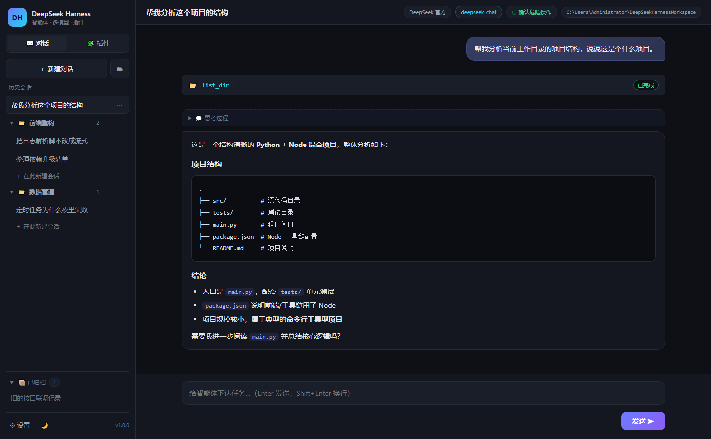

# DeepSeek Harness 桌面版

基于 **Electron** 的 DeepSeek 智能体（Agent）桌面工作台。让 DeepSeek 模型真正动手干活：读写文件、执行命令、搜索代码、抓取网页 —— 全流程可视化，关键操作需你确认。



## ✨ 功能

- **完整 Agent 循环**：模型自主多步调用工具（单任务上限 25 步），直到完成任务并总结
- **六个内置工具**：`read_file` / `write_file` / `list_dir` / `run_command` / `search_files` / `web_fetch`
- **流式输出**：打字机效果实时渲染 Markdown，支持 `deepseek-reasoner` 思考过程折叠展示
- **执行确认（审批）**：三档模式 —— 确认危险操作（默认）/ 全部确认 / 全自动；执行命令与越界写入前会弹出内联审批卡片
- **安全存储**：API Key 使用系统级加密（Windows DPAPI / Electron safeStorage），永不上传
- **会话管理**：多会话持久化、历史回放、关键节点实时落盘
- **容错设计**：模型不支持工具调用时自动降级为纯对话；工具报错自动回填给模型自行修正

## 🚀 快速开始

```bash
# 1. 安装依赖（会下载 Electron 运行时，约 100MB）
npm install

# 2. 启动
npm start

# 3. 首次启动在「设置」中填入 DeepSeek API Key（https://platform.deepseek.com 申请）
```

## 🧪 测试

```bash
npm test          # SSE 解析 / 工具层 / Agent 循环，共 5 个场景 20+ 组断言
npm run smoke     # Electron 冒烟测试（窗口加载 + 无崩溃退出）
```

## 🏗 架构

```
src/
├── main/                 # Electron 主进程
│   ├── main.js           # 窗口、IPC、审批流、会话编排
│   ├── agent.js          # Agent 主循环（流式聚合、工具调度、降级容错）
│   ├── tools.js          # 六个内置工具 + 路径守卫
│   ├── store.js          # 设置与会话持久化（userData 目录）
│   ├── sse.js            # 增量 SSE 解析器
│   └── preload.js        # contextBridge 安全桥接
└── renderer/             # 渲染层（原生 HTML/CSS/JS，无框架）
    ├── index.html
    ├── app.js            # 事件驱动的聊天 UI
    └── style.css         # 暗色主题
```

安全基线：`contextIsolation` 开启、`nodeIntegration` 关闭、严格 CSP（`script-src 'self'`），渲染层不接触 Node 能力。

## ⚙️ 设置项

| 项 | 说明 |
| --- | --- |
| API Key | 系统级加密存储在本机 |
| 模型 | `deepseek-chat`（支持工具调用）/ `deepseek-reasoner`（深度思考） |
| 温度 / 最大输出 tokens | 常规生成参数 |
| 执行确认模式 | 危险操作确认（推荐）/ 全部确认 / 全自动 |
| 工作目录 | 智能体的默认工作区，文件操作以此为根 |

## 📄 License

MIT © HaydenSmith1121
