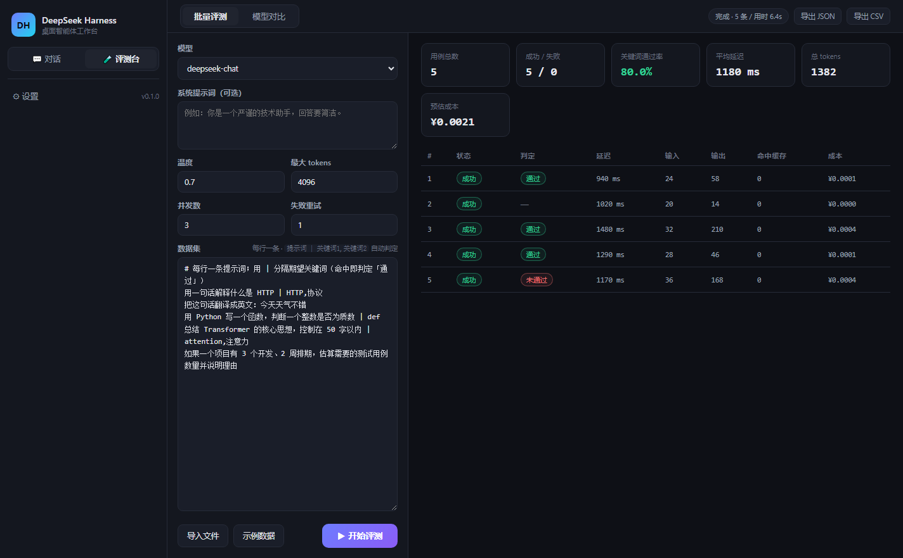

# DeepSeek Harness 桌面版

基于 **Electron** 的 DeepSeek 桌面工作台，一个应用里解决两件事：

- **智能体对话** —— 让模型真正动手干活：读写文件、执行命令、搜索代码、抓取网页，全流程可视化，关键操作需你确认。
- **评测台** —— 把 DeepSeek API 当工程对象来调：批量跑用例、自动判定、统计延迟与 token 成本、多模型并排对比。

界面为无框架原生实现，启动即用，纯本地运行（API Key 系统级加密存放在本机）。




## ✨ 功能

### 智能体对话

- **完整 Agent 循环**：模型自主多步调用工具（单任务上限 25 步），直到完成任务并总结
- **六个内置工具**：`read_file` / `write_file` / `list_dir` / `run_command` / `search_files` / `web_fetch`
- **流式输出**：打字机效果实时渲染 Markdown，支持 `deepseek-reasoner` 思考过程折叠展示
- **执行确认（审批）**：三档模式 —— 确认危险操作（默认）/ 全部确认 / 全自动；执行命令与越界写入前会弹出内联审批卡片
- **会话管理**：多会话持久化、历史回放、关键节点实时落盘
- **容错设计**：模型不支持工具调用时自动降级为纯对话；工具报错自动回填给模型自行修正

### 评测台

- **批量评测**：一行一条用例，支持 `提示词 | 关键词1,关键词2` 语法自动判定通过/未通过
- **并发控制**：可调并发数与失败重试次数，abort 时可随时中断且结果不留空洞
- **成本核算**：按 DeepSeek 官方价格（区分缓存命中 / 未命中 / 输出）估算每次调用与整轮成本（¥）
- **模型对比**：多个配置（模型 + 温度 + max_tokens）跑同一批提示词，输出并排对比与聚合指标
- **数据集导入 / 结果导出**：支持导入 `txt`/`csv`/`jsonl`，导出 `JSON` 或带 BOM 的 `CSV`（Excel 打开不乱码）

### 通用

- **安全存储**：API Key 使用系统级加密（Windows DPAPI / Electron safeStorage），永不上传
- **纯本地**：无遥测、无外部服务，只与你自己配置的 API 地址通信

## 🚀 快速开始

### 方式一：下载可执行文件（推荐）

到 [Releases](https://github.com/HaydenSmith1121/deepseek-harness-studio/releases) 下载：

- **`DeepSeek-Harness-Setup-<版本>.exe`** — 安装版，双击安装到系统
- **`DeepSeek-Harness-Portable-<版本>.exe`** — 便携版，单文件免安装，双击即用

首次启动在「设置」中填入 DeepSeek API Key（[platform.deepseek.com](https://platform.deepseek.com) 申请）即可。

> 若在虚拟机 / 无 GPU 环境中窗口异常，可给 exe 加参数 `--no-sandbox --disable-gpu` 启动。

### 方式二：源码运行

```bash
npm install     # 会下载 Electron 运行时（约 100MB）
npm start
```

### 打包自己的 exe

```bash
npm run dist              # 便携版 + 安装版，产物在 dist/
npm run dist:portable     # 只打便携版
```

国内网络建议先设置镜像：

```bash
export ELECTRON_MIRROR=https://npmmirror.com/mirrors/electron/
export ELECTRON_BUILDER_BINARIES_MIRROR=https://npmmirror.com/mirrors/electron-builder-binaries/
```

## 🧪 测试

```bash
npm test           # 48 组断言：SSE 解析 / 工具层 / Agent 循环 / 评测台(API·调度·成本·批量·对比)
npm run smoke      # Electron 冒烟测试（窗口加载 + 无崩溃退出）
```

## 🏗 架构

```
src/
├── main/                 # Electron 主进程
│   ├── main.js           # 窗口、IPC、审批流、会话编排
│   ├── agent.js          # Agent 主循环（流式聚合、工具调度、降级容错）
│   ├── tools.js          # 六个内置工具 + 路径守卫
│   ├── lab.js            # 评测台 IPC（批量评测 / 模型对比 / 导入导出）
│   ├── api.js            # DeepSeek API 客户端（SSE、参数净化、usage 归一化）
│   ├── batch.js          # 批量与对比执行器 + 数据集解析 + 关键词判定
│   ├── scheduler.js      # 并发调度（保序、可中断、无稀疏空洞）
│   ├── stats.js          # token / 延迟 / 成本聚合
│   ├── store.js          # 设置与会话持久化（userData 目录）
│   ├── sse.js            # 增量 SSE 解析器
│   └── preload.js        # contextBridge 安全桥接
└── renderer/             # 渲染层（原生 HTML/CSS/JS，无框架）
    ├── index.html
    ├── app.js            # 事件驱动的聊天 UI
    ├── lab.js            # 评测台 UI（批量表格 / 并排对比 / 导出）
    ├── style.css         # 暗色主题
    └── vendor/marked.min.js  # 本地内置 Markdown 渲染器（不依赖 node_modules）
```

安全基线：`contextIsolation` 开启、`nodeIntegration` 关闭、严格 CSP（`script-src 'self'`），渲染层不接触 Node 能力。打包时 `files` 只收集 `src/**`，运行期不依赖 `node_modules`。

## ⚙️ 设置项

| 项 | 说明 |
| --- | --- |
| API Key | 系统级加密存储在本机 |
| 模型 | `deepseek-chat`（支持工具调用）/ `deepseek-reasoner`（深度思考） |
| 温度 / 最大输出 tokens | 常规生成参数 |
| 执行确认模式 | 危险操作确认（推荐）/ 全部确认 / 全自动 |
| 工作目录 | 智能体的默认工作区，文件操作以此为根 |
| API 地址 | 默认 `https://api.deepseek.com`，可指向任意 OpenAI 兼容端点 |

## 📄 License

MIT © HaydenSmith1121
