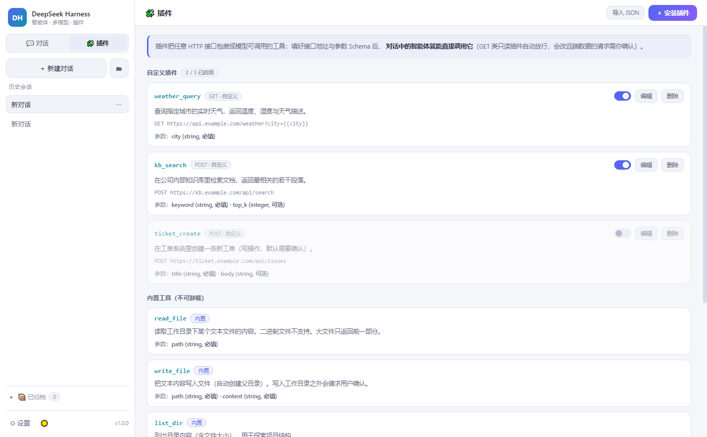

# DeepSeek Harness 桌面版

基于 **Electron** 的本地智能体工作台：让模型真正动手干活 —— 读写文件、执行命令、搜索代码、抓取网页，
关键操作需要你确认；同时支持接入任意 OpenAI 兼容模型、安装自定义插件、深色 / 浅色双主题。

界面为无框架原生实现，启动即用，纯本地运行（API Key 系统级加密存放在本机）。




## ✨ 功能

### 智能体对话

- **完整 Agent 循环**：模型自主多步调用工具（单任务上限 25 步），直到完成任务并总结
- **六个内置工具**：`read_file` / `write_file` / `list_dir` / `run_command` / `search_files` / `web_fetch`
- **流式输出**：打字机效果实时渲染 Markdown，支持 `deepseek-reasoner` 思考过程折叠展示
- **执行确认（审批）**：三档模式 —— 确认危险操作（默认）/ 全部确认 / 全自动；执行命令、越界写入、写类插件调用前会弹出内联审批卡片
- **容错设计**：模型不支持工具调用时自动降级为纯对话；工具报错自动回填给模型自行修正

### 会话管理

- **文件夹分组**：侧栏可建文件夹，把会话拖进不同项目下；文件夹支持折叠、重命名、批量归档
- **归档**：不想删又不想看的会话一键归档，收进底部「已归档」抽屉，可随时还原或彻底删除
- **持久化**：每次关键节点（助手回复 / 工具结果）即时落盘，崩溃不丢对话

### 多模型服务商

- 内置 DeepSeek / OpenAI / Moonshot(Kimi) / 智谱 GLM / 通义千问 / SiliconFlow / OpenRouter / Ollama 预设，也可自定义任意 OpenAI 兼容网关
- **每个服务商独立 API Key**，一样走系统级加密；切换服务商自动带出对应的接口地址与模型列表
- 支持一键从服务商 `/models` **拉取模型列表**，也可以直接手填模型名

### 插件

- 把**任意 HTTP 接口包装成模型可调用的工具**：填工具名、描述、URL 模板（`{{参数}}` 占位）、参数 JSON Schema 即可
- 支持 GET / POST / PUT / PATCH / DELETE，自定义请求头与请求体模板，可设超时
- 支持 **导入 JSON** 批量安装；插件可随时启用 / 停用
- 审批策略：只读 GET 自动放行，会改远端数据的请求需要你确认
- 内置六个工具在插件页可见但不可卸载，避免误删核心能力

### 通用

- **深色 / 浅色双主题**：侧栏一键切换（🌙 / ☀️），也可在设置里选，偏好本地持久化
- **输入框**：随内容自动增高，到上限后内部滚动但**不显示滚动条**，界面始终干净
- **安全存储**：API Key 使用系统级加密（Windows DPAPI / Electron safeStorage），永不上传
- **纯本地**：无遥测、无外部服务，只与你自己配置的 API 地址通信

## 🚀 快速开始

### 方式一：下载可执行文件（推荐）

到 [Releases](https://github.com/HaydenSmith1121/deepseek-harness-studio/releases) 下载：

- **`DeepSeek-Harness-Setup-<版本>.exe`** — 安装版，双击安装到系统
- **`DeepSeek-Harness-Portable-<版本>.exe`** — 便携版，单文件免安装，双击即用

首次启动在「设置」里选择模型服务商并填入对应 API Key（DeepSeek 官方在 [platform.deepseek.com](https://platform.deepseek.com) 申请）即可。

> 若在虚拟机 / 无 GPU 环境中窗口异常，可给 exe 加参数 `--no-sandbox --disable-gpu` 启动。

### 方式二：源码运行

```bash
npm install     # 会下载 Electron 运行时（约 100MB）
npm start
```

### 打包自己的 exe

```bash
npm run dist              # 便携版 + 安装版，产物在 dist/
npm run dist:portable     # 只打便携版
```

国内网络建议先设置镜像：

```bash
export ELECTRON_MIRROR=https://npmmirror.com/mirrors/electron/
export ELECTRON_BUILDER_BINARIES_MIRROR=https://npmmirror.com/mirrors/electron-builder-binaries/
```

## 🧪 测试

```bash
npm test           # SSE 解析 / 工具层 / Agent 循环 / 会话与归档存储 / 插件系统（校验、模板、真实 HTTP）
npm run smoke      # Electron 冒烟测试（窗口加载 + 无崩溃退出）
```

## 🏗 架构

```
src/
├── main/                 # Electron 主进程
│   ├── main.js           # 窗口、IPC、多服务商、文件夹/归档、审批流、插件派发
│   ├── agent.js          # Agent 主循环（流式聚合、工具调度、降级容错）
│   ├── tools.js          # 六个内置工具 + 路径守卫
│   ├── plugins.js        # 插件校验 / schema 生成 / HTTP 执行
│   ├── api.js            # OpenAI 兼容端点（模型列表拉取）
│   ├── store.js          # 设置、服务商、插件、会话与文件夹持久化（userData 目录）
│   ├── sse.js            # 增量 SSE 解析器
│   └── preload.js        # contextBridge 安全桥接
└── renderer/             # 渲染层（原生 HTML/CSS/JS，无框架）
    ├── index.html
    ├── app.js            # 聊天 UI + 主题 + 会话/文件夹/归档 + 设置与服务商管理
    ├── plugins.js        # 插件页（安装 / 编辑 / 启停 / 导入）
    ├── style.css         # 深色与浅色双主题（CSS 变量）
    └── vendor/marked.min.js  # 本地内置 Markdown 渲染器（不依赖 node_modules）
```

安全基线：`contextIsolation` 开启、`nodeIntegration` 关闭、严格 CSP（`script-src 'self'`），渲染层不接触 Node 能力。打包时 `files` 只收集 `src/**`，运行期不依赖 `node_modules`。

## ⚙️ 设置项

| 项 | 说明 |
| --- | --- |
| 服务商 | 可增删改的模型服务商列表，各自独立的接口地址与 API Key |
| API Key | 按服务商分别系统级加密存储在本机 |
| 接口地址 | 当前服务商的 OpenAI 兼容端点（填到 `/v1` 一级） |
| 模型 | 手填或从服务商拉取列表中选择 |
| 温度 / 最大输出 tokens | 常规生成参数 |
| 执行确认模式 | 危险操作确认（推荐）/ 全部确认 / 全自动 |
| 工作目录 | 智能体的默认工作区，文件操作以此为根 |
| 主题 | 深色（夜间模式）/ 浅色（白天模式） |

## 📄 License

MIT © HaydenSmith1121
